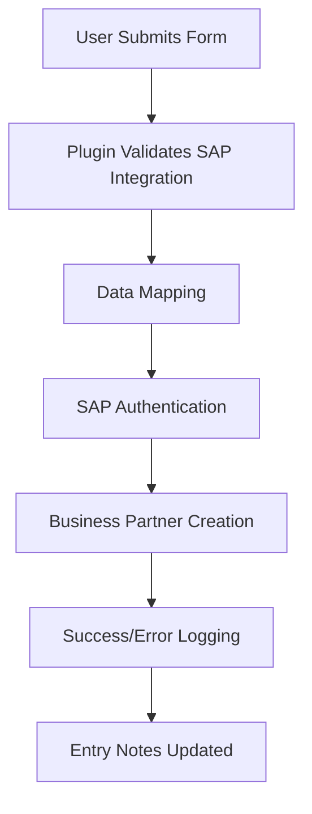

# Shift8 Integration for Gravity Forms and SAP Business One


A secure WordPress plugin that integrates Gravity Forms with SAP Business One, automatically creating Business Partner records from form submissions.

## 🚀 Features

- **Seamless Integration**: Direct integration with SAP Business One Service Layer API
- **Field Mapping**: Flexible mapping between Gravity Forms fields and SAP Business Partner fields
- **Security First**: Password encryption, input validation, and secure API communication
- **Real-time Testing**: Built-in connection and integration testing tools
- **Comprehensive Logging**: Detailed debug logging with sensitive data protection
- **User-Friendly Interface**: Intuitive settings and configuration interface
- **Error Handling**: Robust error handling with detailed feedback

## 📋 Requirements

### WordPress Environment
- **WordPress**: 5.0 or higher
- **PHP**: 7.4 or higher
- **Gravity Forms**: Latest version required

### SAP Business One Environment
- **SAP Business One**: Version 9.3 or higher
- **Service Layer**: Properly configured and accessible
- **User Permissions**: SAP user with Business Partner creation rights
- **Numbering Series**: Configured for Business Partners in SAP B1

## 🔧 Installation

1. Download the plugin ZIP file
2. Go to **WordPress Admin > Plugins > Add New**
3. Click **Upload Plugin** and select the ZIP file
4. Click **Install Now** and then **Activate**

## ⚙️ Configuration

### Step 1: Configure SAP Connection
1. Navigate to **WordPress Admin > Shift8 > Gravity SAP**
2. Enter your SAP connection details:
   - **SAP Service Layer Endpoint**: `https://your-sap-server:50000/b1s/v1/`
   - **Company Database**: Your SAP company database name
   - **Username**: SAP user with Business Partner permissions
   - **Password**: SAP user password (automatically encrypted)
3. Enable **Debug Logging** if needed for troubleshooting
4. Click **Save Settings**
5. Click **Test SAP Connection** to verify connectivity

### Step 2: Configure Gravity Forms Integration
1. Go to **WordPress Admin > Forms** and select a form
2. Click **Settings > SAP Integration**
3. Check **Enable SAP Integration**
4. Enter a **Feed Name** for identification
5. Select **Business Partner Type** (Customer, Vendor, or Lead)
6. Map form fields to SAP Business Partner fields
7. Click **Update Settings**

### Step 3: Test Integration
1. Click **Test Numbering Series** to verify SAP configuration
2. Enter test data and click **Test Integration**
3. Verify Business Partner creation in SAP Business One

## 🗺️ Field Mapping

| SAP Field | Description | Required |
|-----------|-------------|----------|
| `CardName` | Business Partner Name | ✅ Yes |
| `EmailAddress` | Email Address | ❌ No |
| `Phone1` | Primary Phone Number | ❌ No |
| `BPAddresses.Street` | Street Address | ❌ No |
| `BPAddresses.City` | City | ❌ No |
| `BPAddresses.State` | State/Province | ❌ No |
| `BPAddresses.ZipCode` | Zip/Postal Code | ❌ No |

## 🧪 Testing

This plugin includes a comprehensive automated testing suite:

- **65 automated tests** with **137 assertions**
- **53% code coverage** across core functionality
- **Brain/Monkey testing framework** for WordPress unit testing
- **Mocked SAP API responses** for reliable testing
- **CI-ready** test configuration

Run tests locally:
```bash
composer test
composer test:coverage
```

## 🔒 Security Features

- **Password Encryption**: All passwords encrypted using WordPress salts
- **Input Validation**: All data sanitized and validated
- **Secure Communication**: HTTPS API communication
- **Access Control**: Admin-only access with capability checks
- **Debug Protection**: Sensitive data automatically redacted from logs

## 🔧 Troubleshooting

### ❌ Connection Issues
1. Verify SAP Service Layer is running
2. Check endpoint URL format
3. Test credentials in SAP Business One
4. Review debug logs for detailed error information

### 🔢 Numbering Series Issues
1. Configure numbering series in SAP B1 Administration
2. Go to **Administration > System Initialization > Document Numbering**
3. Set up series for Business Partners
4. Ensure default series are configured

## ⚡ How It Works



1. User submits Gravity Form with mapped fields
2. Plugin validates form has SAP integration enabled
3. Data mapping occurs between form fields and SAP fields
4. SAP authentication using encrypted credentials
5. Business Partner creation via SAP Service Layer API
6. Success/error logging and entry notes

## 📞 Support

For support and documentation:
- 🐛 Review debug logs for error details
- 🧪 Use built-in connection testing tools
- 📚 Check SAP Service Layer documentation
- 🌐 Contact: [https://www.shift8web.ca](https://www.shift8web.ca)

## 🤝 Contributing

1. Fork the repository
2. Create a feature branch (`git checkout -b feature/amazing-feature`)
3. Commit your changes (`git commit -m 'Add amazing feature'`)
4. Push to the branch (`git push origin feature/amazing-feature`)
5. Open a Pull Request

## 📄 License

This project is licensed under the GNU General Public License v3.0 - see the [LICENSE](LICENSE) file for details.

## 🏷️ Plugin Information

- **Contributors**: shift8
- **Tags**: gravity forms, sap, business one, integration, crm
- **Requires WordPress**: 5.0+
- **Tested up to**: 6.8
- **Requires PHP**: 7.4+
- **License**: GPLv3 