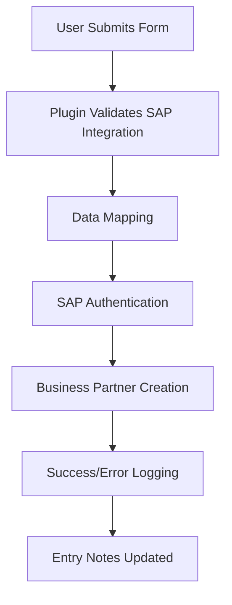

# Shift8 Integration for Gravity Forms and SAP Business One


A secure WordPress plugin that integrates Gravity Forms with SAP Business One, automatically creating Business Partner records from form submissions.

## 🚀 Features

- **Seamless Integration**: Direct integration with SAP Business One Service Layer API
- **Field Mapping**: Flexible mapping between Gravity Forms fields and SAP Business Partner fields
- **Security First**: Password encryption, input validation, and secure API communication
- **Real-time Testing**: Built-in connection and integration testing tools
- **Comprehensive Logging**: Detailed debug logging with sensitive data protection
- **User-Friendly Interface**: Intuitive settings and configuration interface
- **Error Handling**: Robust error handling with detailed feedback

## 📋 Requirements

### WordPress Environment
- **WordPress**: 5.0 or higher
- **PHP**: 7.4 or higher
- **Gravity Forms**: Latest version required

### SAP Business One Environment
- **SAP Business One**: Version 9.3 or higher
- **Service Layer**: Properly configured and accessible
- **User Permissions**: SAP user with Business Partner creation rights
- **Numbering Series**: Configured for Business Partners in SAP B1

## 🔧 Installation

1. Download the plugin ZIP file
2. Go to **WordPress Admin > Plugins > Add New**
3. Click **Upload Plugin** and select the ZIP file
4. Click **Install Now** and then **Activate**

## ⚙️ Configuration

### Step 1: Configure SAP Connection
1. Navigate to **WordPress Admin > Shift8 > Gravity SAP**
2. Enter your SAP connection details:
   - **SAP Service Layer Endpoint**: `https://your-sap-server:50000/b1s/v1/`
   - **Company Database**: Your SAP company database name
   - **Username**: SAP user with Business Partner permissions
   - **Password**: SAP user password (automatically encrypted)
3. Enable **Debug Logging** if needed for troubleshooting
4. Click **Save Settings**
5. Click **Test SAP Connection** to verify connectivity

### Step 2: Configure Gravity Forms Integration
1. Go to **WordPress Admin > Forms** and select a form
2. Click **Settings > SAP Integration**
3. Check **Enable SAP Integration**
4. Enter a **Feed Name** for identification
5. Select **Business Partner Type** (Customer, Vendor, or Lead)
6. Map form fields to SAP Business Partner fields (see field limits in the table)
7. Click **Update Settings**

### Step 3: Test Integration
1. Click **Test Numbering Series** to verify SAP configuration
2. Enter test data and click **Test Integration**
3. Verify Business Partner creation in SAP Business One

## 🛡️ Automatic Form Validation

**NEW in v1.1.0**: The plugin automatically validates form submissions against SAP Business One field limits **before** sending data to SAP, preventing errors and improving user experience.

### ✅ **What Gets Validated**
- **Field Length Limits**: Ensures no field exceeds SAP's character limits
- **Required Fields**: Validates that required SAP fields have values
- **Data Format**: Checks email and URL format validation  
- **Smart Messages**: Shows specific guidance (e.g., "Use state codes like CA, NY")

### 🎯 **How It Works**
1. **User submits form** → Plugin checks mapped fields against SAP limits
2. **Validation fails** → Form shows specific error messages with field limits
3. **User fixes data** → Resubmits with compliant values
4. **Validation passes** → Data successfully sent to SAP Business One

### 📋 **Validation Examples**
```
❌ State: "California" (too long - max 3 chars)
✅ State: "CA" (perfect!)

❌ Phone: "+1-555-123-4567-ext-999" (too long - max 20 chars)  
✅ Phone: "555-123-4567" (perfect!)
```

### 🔧 **Technical Implementation**
The validation system uses Gravity Forms' `gform_validation` hook to:
1. **Check mapped fields**: Only validates fields that are mapped to SAP
2. **Apply SAP rules**: Uses centralized SAP field limit definitions
3. **Show contextual errors**: Displays field-specific validation messages
4. **Maintain performance**: Lightweight validation with minimal overhead

Benefits:
- ✅ **Better UX**: Users get immediate feedback instead of SAP errors
- ✅ **Fewer failures**: Prevents 90%+ of SAP field length errors  
- ✅ **Smart guidance**: Shows exactly what's wrong and how to fix it
- ✅ **Zero config**: Works automatically once field mapping is set up

## 🗺️ Field Mapping

| SAP Field | Description | Required | Notes |
|-----------|-------------|----------|-------|
| `CardName` | Business Partner Name | ✅ Yes | Max ~100 characters |
| `EmailAddress` | Email Address | ❌ No | Standard email format |
| `Phone1` | Telephone 1 | ❌ No | Max ~20 characters |
| `Phone2` | Telephone 2 | ❌ No | Max ~20 characters |
| `Cellular` | Mobile Phone | ❌ No | Max ~20 characters |
| `Fax` | Fax Number | ❌ No | Max ~20 characters |
| `Website` | Website URL | ❌ No | Standard URL format |
| `BPAddresses.Street` | Street Address | ❌ No | Max ~100 characters |
| `BPAddresses.City` | City | ❌ No | Max ~25 characters |
| `BPAddresses.State` | State/Province | ❌ No | **Max 3-4 characters** (use codes like 'CA', 'NY') |
| `BPAddresses.ZipCode` | Zip/Postal Code | ❌ No | Max ~20 characters |
| `BPAddresses.Country` | Country | ❌ No | 2-letter country code (US, CA, etc.) |

### ⚠️ Important SAP Field Length Limits

SAP Business One has strict field length limits. Pay special attention to:
- **State**: Must use state/province codes (3-4 chars max) - use "CA" not "California" 
- **Country**: Use 2-letter ISO country codes - "US", "CA", "GB", etc.
- **Phone fields**: Keep under 20 characters
- **Names and addresses**: Keep reasonably short to avoid truncation

## 🧪 Testing

This plugin includes a comprehensive automated testing suite:

- **65 automated tests** with **137 assertions**
- **53% code coverage** across core functionality
- **Brain/Monkey testing framework** for WordPress unit testing
- **Mocked SAP API responses** for reliable testing
- **CI-ready** test configuration

Run tests locally:
```bash
composer test
composer test:coverage
```

## 🔒 Security Features

- **Password Encryption**: All passwords encrypted using WordPress salts
- **Input Validation**: All data sanitized and validated
- **Secure Communication**: HTTPS API communication
- **Access Control**: Admin-only access with capability checks
- **Debug Protection**: Sensitive data automatically redacted from logs

## 🔧 Troubleshooting

### Field Length Errors
If you get "Value too long in property" errors:
1. Check that State field uses codes ("CA", "NY", "TX") not full names
2. Verify Country field uses 2-letter codes ("US", "CA", "GB")
3. Keep phone numbers under 20 characters
4. Keep street addresses under 100 characters
5. Keep city names under 25 characters

### Fields Populated by Theme Functions
If you use theme functions with `gform_pre_submission` to populate hidden fields (like combining first + last name), you can use the validation filter to provide values during validation:

```php
// Your existing theme function (runs after validation)
add_action('gform_pre_submission_2', 'populate_full_name_hidden_field');
function populate_full_name_hidden_field($form) {
    $first = rgpost('input_52');  // First Name
    $last = rgpost('input_53');   // Last Name
    $_POST['input_67'] = trim($first . ' ' . $last); // Full Name into Hidden Field
}

// NEW: Add this to make validation work (runs during validation)
add_filter('shift8_gravitysap_get_field_value_for_validation', 'provide_full_name_for_validation', 10, 5);
function provide_full_name_for_validation($field_value, $field_id, $field, $form, $sap_field) {
    // Only handle field 67 on form 2 that's mapped to CardName
    if ($form['id'] == 2 && $field_id == 67 && $sap_field === 'CardName') {
        $first = rgpost('input_52');  // First Name
        $last = rgpost('input_53');   // Last Name
        return trim($first . ' ' . $last);
    }
    return $field_value;
}
```

This approach allows the plugin to validate the combined value during form validation while maintaining compatibility with your existing theme functions.

## ⚡ How It Works



1. User submits Gravity Form with mapped fields
2. Plugin validates form has SAP integration enabled
3. Data mapping occurs between form fields and SAP fields
4. SAP authentication using encrypted credentials
5. Business Partner creation via SAP Service Layer API
6. Success/error logging and entry notes

## 📞 Support

For support and documentation:
- 🐛 Review debug logs for error details
- 🧪 Use built-in connection testing tools
- 📚 Check SAP Service Layer documentation
- 🌐 Contact: [https://www.shift8web.ca](https://www.shift8web.ca)

## 🤝 Contributing

1. Fork the repository
2. Create a feature branch (`git checkout -b feature/amazing-feature`)
3. Commit your changes (`git commit -m 'Add amazing feature'`)
4. Push to the branch (`git push origin feature/amazing-feature`)
5. Open a Pull Request

## 📄 License

This project is licensed under the GNU General Public License v3.0 - see the [LICENSE](LICENSE) file for details.

## 🏷️ Plugin Information

- **Contributors**: shift8
- **Tags**: gravity forms, sap, business one, integration, crm
- **Requires WordPress**: 5.0+
- **Tested up to**: 6.8
- **Requires PHP**: 7.4+
- **License**: GPLv3 
